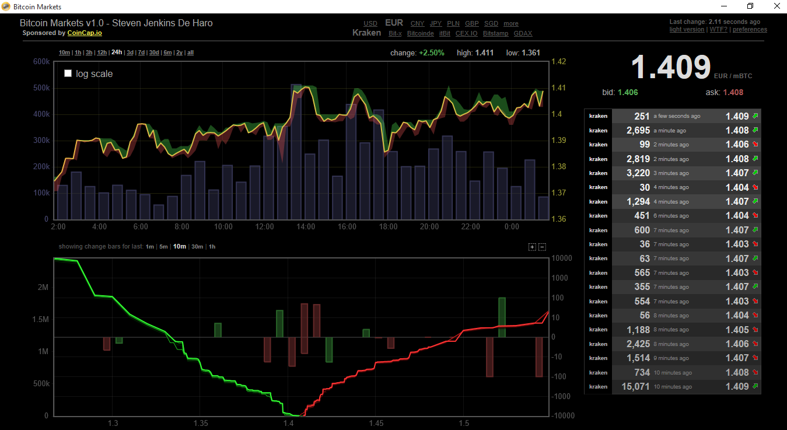

# Bitcoin Markets

This application monitors the Bitcoin markets with live up to the second data. It accomplishes this by converting a web page from bitcoinity.org to a local application for easier use. You can change the Bitcoin units from mBTC to BTC in the top right corner under preferences. Future features are planned, so stay tuned. 

Releases: [https://github.com/StevenJDH/Bitcoin-Markets/releases](https://github.com/StevenJDH/Bitcoin-Markets/releases)

Changelog: [https://github.com/StevenJDH/Bitcoin-Markets/wiki/Changelog](https://github.com/StevenJDH/Bitcoin-Markets/wiki/Changelog)

## Features
* Live Bitcoin charts to view price data and trade volume
* Full screen mode (right-click chart)
* Data from multiple exchanges
* 10 minutes to all time view ranges
* Other settings such as Bitcoin unit
* Multiple currencies supported

## Do you have any questions?
Many commonly asked questions are answered in the FAQ:
[https://github.com/StevenJDH/Bitcoin-Markets/wiki/FAQ](https://github.com/StevenJDH/Bitcoin-Markets/wiki/FAQ)

## Want to show your support?

|Method       | Address                                                                                                    |
|------------:|:-----------------------------------------------------------------------------------------------------------|
|PayPal:      | [https://www.paypal.me/stevenjdh](https://www.paypal.me/stevenjdh "Steven's Paypal Page")                  |
|Bitcoin:     | 3GyeQvN6imXEHVcdwrZwKHLZNGdnXeDfw2                                                                         |
|Litecoin:    | MAJtR4ccdyUQtiiBpg9PwF2AZ6Xbk5ioLm                                                                         |
|Ethereum:    | 0xa62b53c1d49f9C481e20E5675fbffDab2Fcda82E                                                                 |
|Dash:        | Xw5bDL93fFNHe9FAGHV4hjoGfDpfwsqAAj                                                                         |
|Zcash:       | t1a2Kr3jFv8WksgPBcMZFwiYM8Hn5QCMAs5                                                                        |
|PIVX:        | DQq2qeny1TveZDcZFWwQVGdKchFGtzeieU                                                                         |
|Ripple:      | rLHzPsX6oXkzU2qL12kHCH8G8cnZv1rBJh Destination Tag: 2357564055                                        |
|Monero:      | 4GdoN7NCTi8a5gZug7PrwZNKjvHFmKeV11L6pNJPgj5QNEHsN6eeX3D &#8618;aAQFwZ1ufD4LYCZKArktt113W7QjWvQ7CWDXrwM8yCGgEdhV3Wt|

// Steven Jenkins De Haro ("StevenJDH" on GitHub)
